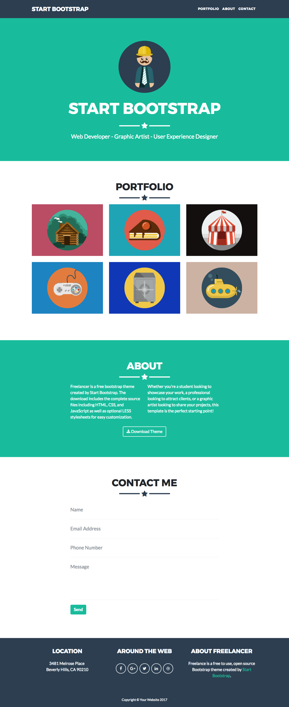

# Freelancer
## Autora
Melissa Yauri

***

## Objetivo

El presente trabajo consta de replicar el sitio de **Freelancer** tal y como lo muestra la siguiente imagen.

## Herramientas
* Html
* CSS
* Tipografía:`Montserrat` y `Lato`.
* Colores:`#2c3e50`, `#18bc9c`,`#212529`.
* Iconos: [Font Awesome](http://fontawesome.io/).
* Pseudoelementos: `:after`, `:before`
* Formulario: etiqueta `form`

## Contenido
* Encabezado: Se utiliza una lista para el menú de navegación y se posiciona a la derecha con la propieda float.

* Primera sección: Tiene el título "Portfolio" y columnas de imágenes,que se posicionan con la propiedad display inline-block. Asimismo se hace uso de los pseudoelementos para realizar las línea laterales del ícono estrella que se repite en todas la secciones.

* Segunda sección: Empieza con el título "About" y con una columnas de parrafos posicionada con la propiedad display inline-block.También se utiliza la etiqueta button para realizar el botón download.

* Tercera sección: Compuesta por el título "Contact Me" y el formulario con la etiqueta form.

* Pie de página: Compuesto por colummnas posicionadas por la propiedad float e iconos.
